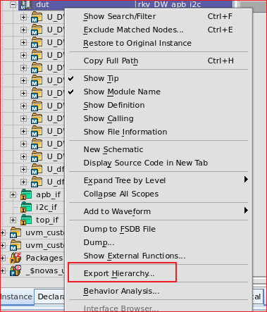
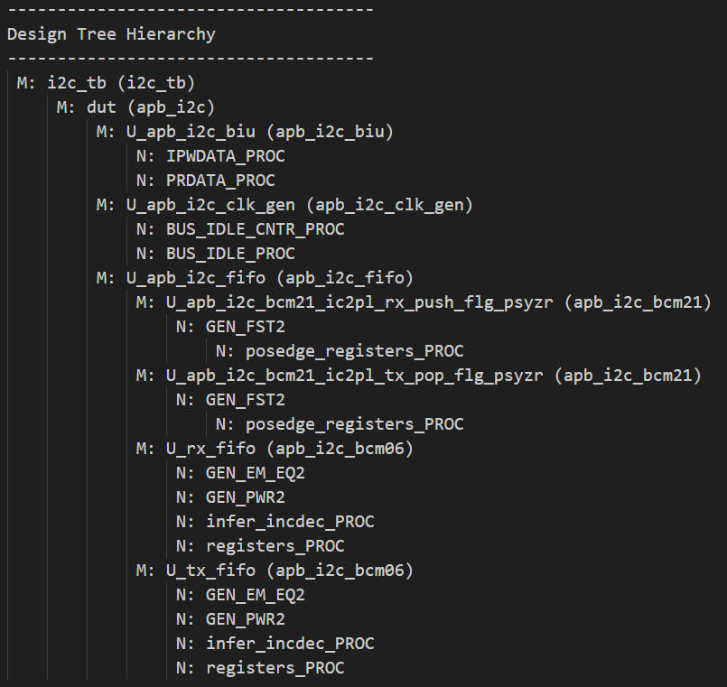
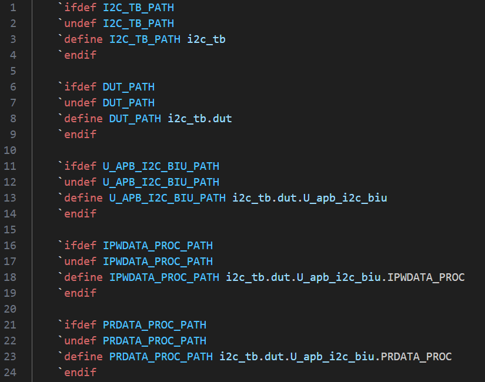
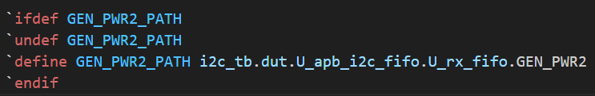
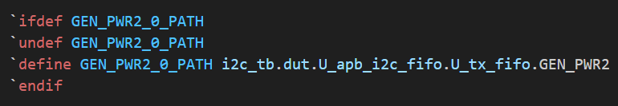

# IC_tools

[](https://opensource.org/licenses/Apache-2.0)

在工作中开发的一些有用的IC小工具

## 1. RTL Hierarchy PATH Generator Scripts

基于verdi文件产生设计不同层次的宏定义path，用于取代绝对层次路径，提升后续项目中的可复用性

目录结构：
- rtl_hier_gen
  - rtl_hier_gen.py
  - content.txt
  - README.md
  - demo.sv

How to use :

(1) Export Hierarchy via Verdi GUI



导出后文件为：



(2) 执行脚本

```bash
python3 rtl_hier_gen.py -f content.txt -o demo.sv
```

执行完成后，可以看到如下文件：



如果有同名不同路径的模块，会自动在后面加后缀用于区分：





## 2. warning_lint_filter

基于vcs编译仿真log，通过正则表达式过滤warning & lint信息，产生warning和lint的报告。
```
python3 warning_lint_filter.py -f vcs.log -o warning.rpt
```