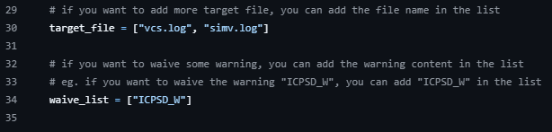

# IC_tools

[](https://opensource.org/licenses/Apache-2.0)

在工作中开发的一些有用的IC小工具

## 1. RTL Hierarchy PATH Generator Scripts

基于verdi文件产生设计不同层次的宏定义path，用于取代绝对层次路径，提升后续项目中的可复用性

目录结构：
- rtl_hier_gen
  - rtl_hier_gen.py
  - content.txt
  - README.md
  - demo.sv

How to use :

(1) Export Hierarchy via Verdi GUI


导出后文件为：


(2) 执行脚本

```bash
python3 rtl_hier_gen.py -f content.txt -o demo.sv
```

执行完成后，可以看到如下文件：


如果有同名不同路径的模块，会自动在后面加后缀用于区分：


## 2. warning_lint_filter

基于vcs编译仿真log，通过正则表达式过滤warning & lint信息，产生warning和lint的报告。将脚本复制到你想要检查的路径下，修改下图中的target_file和waive_list列表：



然后执行如下命令 ：

```
python3 warning_lint_filter.py 
```

20250122更新：

- 增加递归匹配文件功能，可以在当前路径及子文件夹中找到目标文件，然后过滤出warning 信息
- 支持将过滤出的所有warning信息去重，然后保存到结果文件
- 支持添加waive list，关键字被添加后，输出的结果将不包含waive list中的内容，waive list匹配的内容，也会独立输出到一个waive.log文件，方便后续review waive的warning。

## 3. dummy block generation
基于pyverilog库，通过调用python库中封装的函数，产生AST语法树，再通过解析语法树提取port信息和module name，产生对应的stub module。input信号输入到模块后悬空，output信号直接进行tie0处理，inout信号也进行tie0处理。

```
该脚本基于pyverilog开发，关于该库的文档可以参考：
https://github.com/PyHDI/Pyverilog
```
使用脚本前，需要安装pyverilog库：
```
sudo apt install iverilog
pip3 install pyverilog
```
运行示例：
```
python3 dummy_gen.py demo.v
python3 dummy_gen.py demo1.v
```
