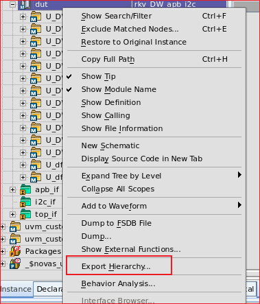
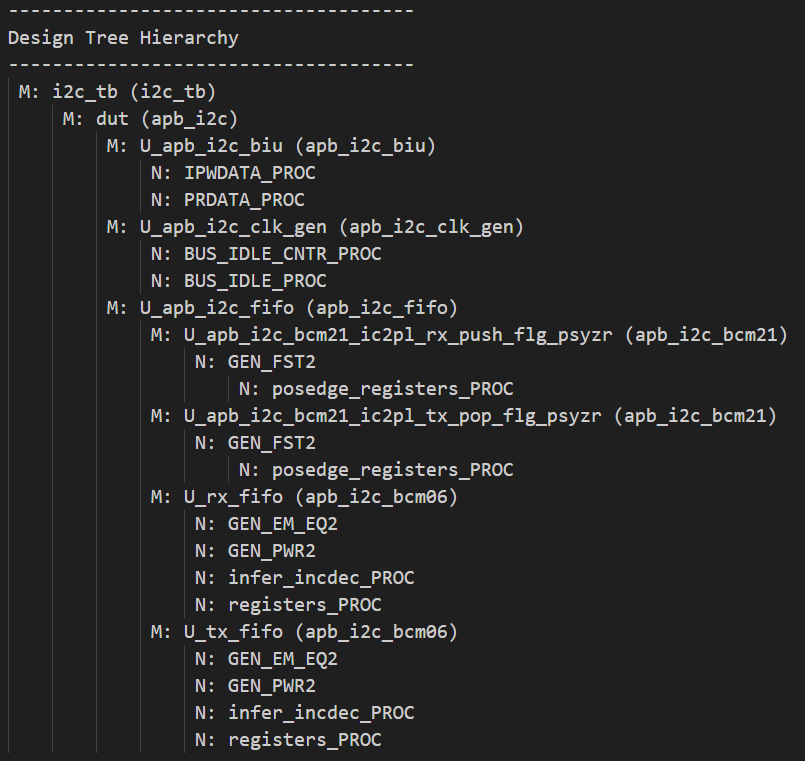
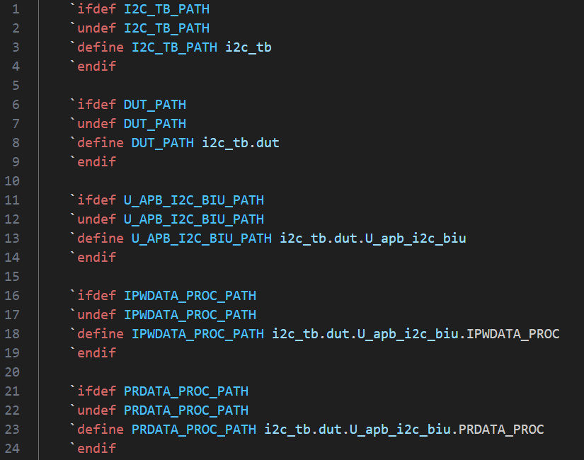
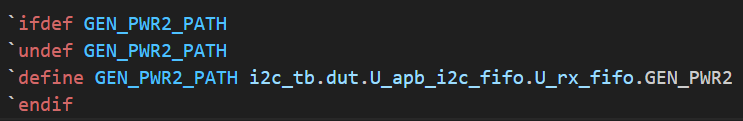
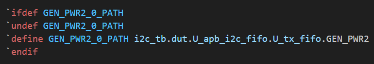
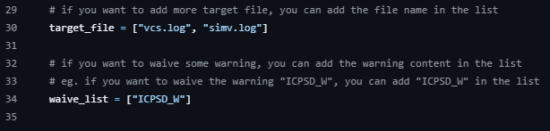
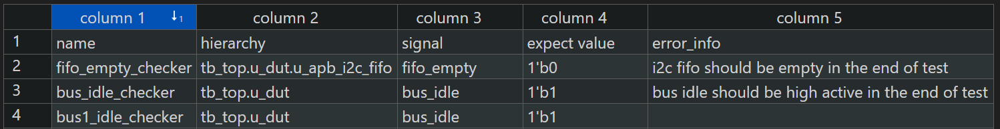

# IC_Tools

[](https://opensource.org/licenses/Apache-2.0)

IC 设计与验证中开发的一些实用工具集，涵盖 RTL 层次路径生成、Warning 过滤、Dummy 模块生成、终态检查、覆盖率报告、LPDDR5 命令监控 VIP 等场景。

## 目录

- [1. RTL Hierarchy PATH Generator](#1-rtl-hierarchy-path-generator)
- [2. Warning / Lint Filter](#2-warning--lint-filter)
- [3. Dummy Block Generation](#3-dummy-block-generation)
- [4. End of Test Checker（终态检查）](#4-end-of-test-checker终态检查)
- [5. Coverage Report Generation](#5-coverage-report-generation)
- [6. LPDDR5 Monitor VIP](#6-lpddr5-monitor-vip)

## 依赖环境

各工具依赖如下，按需安装：

| 工具 | Python 库 | 系统 / EDA 工具 |
|------|----------|-----------------|
| `dummy_gen` | `pyverilog` | `iverilog`（`sudo apt install iverilog`） |
| `gen_cov_report` | `openpyxl` | Synopsys `urg`（需在 PATH 中） |
| `unicode_string` | `pyfiglet` | — |
| `lpddr5_mon_vip` | — | VCS（UVM-1.2）、Verdi（FSDB 波形，可选） |
| 其他 | 标准库即可 | — |

---

## 1. RTL Hierarchy PATH Generator

基于 Verdi 导出的设计层次文件，生成 `define` 宏定义 PATH，用于取代绝对层次路径，提升跨项目复用性。

**目录结构：**

```
rtl_hier_gen/
  ├── rtl_hier_gen.py
  ├── content.txt          # 示例输入：Verdi 导出的层次文件
  ├── demo.sv              # 示例输出
  └── README.md
```

**使用方法：**

1. 通过 Verdi GUI 导出 Hierarchy：
   
   
   
   导出后的文件内容如下：
   
   

2. 执行脚本：

   ```bash
   python3 rtl_hier_gen.py -f content.txt -o demo.sv
   ```

3. 生成结果：

   

   同名不同路径的模块会自动追加后缀（`_0`、`_1` …）加以区分：

   
   

---

## 2. Warning / Lint Filter

基于 VCS 编译仿真 log，通过正则表达式过滤 Warning 和 Lint 信息，生成分类报告。

**使用方法：**

1. 将脚本复制到目标目录下。
2. 修改脚本中的 `target_file` 和 `waive_list` 列表：
   
   

3. 执行：

   ```bash
   python3 warning_lint_filter.py
   ```

**功能特性（2025-01-22 更新）：**

- 递归搜索当前目录及子目录中的目标文件（`vcs.log` / `simv.log`）
- 提取所有 `Warning-*` 块并自动去重，输出到 `warning.log`
- 支持 waive list：命中 waive 关键字的内容单独输出到 `waive.log`，方便后续 review

---

## 3. Dummy Block Generation

基于 [pyverilog](https://github.com/PyHDI/Pyverilog) 库解析 Verilog RTL 的 AST 语法树，提取 module name 和 port 信息，自动生成对应的 stub 模块：
- `input` 端口悬空
- `output` 端口 tie 0（`'h0`）
- `inout` 端口 tie 0（`'h0`）

**依赖安装：**

```bash
sudo apt install iverilog
pip3 install pyverilog
```

**运行示例：**

```bash
# 带 parameter 的模块
python3 dummy_gen.py -i demo.v -o demo_stub.v

# 不带 parameter 的模块
python3 dummy_gen.py -i demo1.v -o demo1_stub.v
```

---

## 4. End of Test Checker（终态检查）

基于输入的 CSV 检查列表，自动生成 SystemVerilog 终态检查模块 `eot_checker.sv`，在仿真结束时检查指定信号的期望值。

- 通过 `$test$plusargs("DISABLE_EOT_CHECKER")` 控制检查开关，默认为开启，方便异常场景下关闭检查
- 支持断言报错级别控制（`$error` / `$warning` / `$info`）

**用法：**

```bash
python3 eot_gen.py -h
```

```
usage: eot_gen.py [-h] [-f INPUT_FILE] [-o OUTPUT_NAME] [-v VERBOSITY]

optional arguments:
  -h, --help            show this help message and exit
  -f INPUT_FILE, --input_file INPUT_FILE
                        input csv file to generate eot file
  -o OUTPUT_NAME, --output_name OUTPUT_NAME
                        output file name
  -v VERBOSITY, --verbosity VERBOSITY
                        verbosity level: 0:Error, 1:Warning, 2:Info
```

**CSV 输入格式：**



| 列名 | 说明 |
|------|------|
| `name` | 断言名称 |
| `hierarchy` | 信号层次路径（推荐使用绝对路径） |
| `signal` | 待检查的信号名 |
| `expect_value` | 仿真结束时信号的期望值 |
| `error_info` | 断言失败时的辅助定位信息（可选，不填则自动生成默认语句） |

生成 `eot_checker.sv` 后，在 Testbench 顶层直接例化即可使用。

---

## 5. Coverage Report Generation

基于 Synopsys `urg` 工具和 `.vdb` 覆盖率数据库，生成格式化的 Excel 覆盖率报告，列出各覆盖类型的未覆盖点。

**用法：**

```bash
python3 gen_coverage_rpt.py -h
```

```
usage: gen_coverage_rpt.py [-h] -m M

Extract coverage data from VDB databases

optional arguments:
  -h, --help  show this help message and exit
  -m M        Module name to extract
```

**运行示例：**

```bash
# 在包含 simv.vdb/ 的目录下执行
python3 gen_coverage_rpt.py -m uart_tx
```

**处理流程：**

1. 调用 `urg -dir *.vdb -format text` 生成文本覆盖率报告
2. 解析 `urgReport/modinfo.txt`，按模块拆分
3. 按覆盖类型（Line / Cond / Toggle / FSM）进一步拆分
4. 生成 `.xlsx` 报告，包含各类型的未覆盖项及对应的源码行号 / 表达式

**输出目录结构：**

```
output/
  ├── trace.log                     # 处理日志
  ├── module/<module>.txt           # 按模块拆分后的原始报告
  ├── module_split/<module>_line.txt
  ├── module_split/<module>_cond.txt
  ├── module_split/<module>_toggle.txt
  ├── module_split/<module>_fsm.txt
  └── <module>.xlsx                 # 最终 Excel 报告
```

---

## 6. LPDDR5 Monitor VIP

自研 LPDDR5 monitor VIP（SystemVerilog + UVM-1.2）：被动采样 CA 总线（CS + CA[6:0]，CK 双沿），解码 JEDEC 命令并输出命令字符串与地址字段（cmd / row / bank / bank_group / col）。解码行为与 Micron LPDDR5 golden 模型逐命令校准对齐（Task 7 / Task 8 校准）。

**目录结构：**

```
lpddr5_mon_vip/
  ├── if/     # 接口：CA 采样与 JEDEC 命令解码
  │   ├── lpddr5_mon_jedec_chip_if.svi           # 单通道接口
  │   └── lpddr5_mon_dual_chan_jedec_chip_if.svi # 双通道接口（内部例化两个单通道接口）
  ├── agent/  # UVM agent（UVM-1.2）
  │   ├── lpddr5_mon_agent_pkg.sv    # 包文件（按依赖序 include 全部类）
  │   ├── lpddr5_mon_transaction.svh # 命令事务（cmd/row/col/bank/bank_group/sample_time）
  │   ├── lpddr5_mon_config.svh      # 配置对象（持有 virtual interface 句柄）
  │   ├── lpddr5_mon_monitor.svh     # monitor：订阅接口事件，事务经 analysis port 输出
  │   ├── lpddr5_mon_agent.svh       # 被动 agent（is_active = UVM_PASSIVE）
  │   └── lpddr5_mon_env.svh         # 环境：例化 2 个 agent（多 rank / 双通道）
  └── tb/     # 自测台与运行脚本
      ├── lpddr5_mon_tb_top.sv        # 单通道自测台（非 UVM，全命令覆盖）
      ├── lpddr5_mon_dual_tb_top.sv   # 双通道自测台（非 UVM）
      ├── lpddr5_mon_uvm_tb_top.sv    # UVM 冒烟自测台
      ├── lpddr5_mon_smoke_test.svh   # UVM 冒烟测试
      ├── run_sim.sh                  # 单通道自测：vcs 编译 + 运行
      ├── run_sim_dual.sh             # 双通道自测
      └── run_sim_uvm.sh              # UVM 冒烟自测
```

**功能特性：**

- 纯被动监控，不驱动 CA 总线；CK 双沿采样——posedge 更新 cmd 字符串，negedge 更新地址字段并完成 AP 变体修正（如 `WR` → `WR_A`、`REFRESH_PER_BANK` → `REFRESH_ALL_BANK`）
- 命令解码覆盖：MRW-1/2、MRR、ACTIVE-1/2、RD / RD16 / RD32（含 `_A` 变体）、WR / WR16 / WR32（含 `_A`）、MASKED_WRITING(_A)、CAS 变体、PRECHARGE(_ALL)、REFRESH_PER/ALL_BANK、MPC 变体、SRE/SRX、PDE/PDX、WFF/RFF/RDC、NOP / DESELECT
- 通过 MRW 序列自动跟踪 bank organization（MR3 data[4:3]：00=BG / 01=8B / 10=16B），模式相关行为自动切换：命令命名（8B 为 `RD`/`WR`，16B/BG 为 `RD16`/`WR16`）、列地址映射（8B `<<5`，16B/BG `<<4`）、bank group 仅在 BG 模式报告
- 事件门控：首个 `cs=1` 命令之前的 DESELECT 不报告；NOP / DESELECT / UNKNOWN 不产生 UVM 事务，保持日志简洁
- 支持单通道 / 双通道接口；UVM 集成通过 config_db 键 `lpddr5_mon_vif_0/1` 传入 virtual interface，monitor 将解码结果打包为事务经 analysis port 输出

**运行自测：**

```bash
cd lpddr5_mon_vip/tb
./run_sim.sh        # 单通道自测（非 UVM）
./run_sim_dual.sh   # 双通道自测（非 UVM）
./run_sim_uvm.sh    # UVM 冒烟自测
```

自测脚本基于 VCS 编译运行（`-kdb`），通过后打印 `PASS`；默认 `+define+WAVES_FSDB` 转储 FSDB 波形（需 Verdi PLI）。
