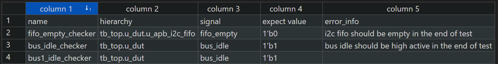

# IC_tools

[](https://opensource.org/licenses/Apache-2.0)

在工作中开发的一些有用的IC小工具

## 1. RTL Hierarchy PATH Generator Scripts

基于verdi文件产生设计不同层次的宏定义path，用于取代绝对层次路径，提升后续项目中的可复用性

目录结构：

- rtl_hier_gen
  - rtl_hier_gen.py
  - content.txt
  - README.md
  - demo.sv

How to use :

(1) Export Hierarchy via Verdi GUI


导出后文件为：


(2) 执行脚本

```bash
python3 rtl_hier_gen.py -f content.txt -o demo.sv
```

执行完成后，可以看到如下文件：


如果有同名不同路径的模块，会自动在后面加后缀用于区分：


## 2. warning_lint_filter

基于vcs编译仿真log，通过正则表达式过滤warning & lint信息，产生warning和lint的报告。将脚本复制到你想要检查的路径下，修改下图中的target_file和waive_list列表：


然后执行如下命令 ：

```
python3 warning_lint_filter.py 
```

20250122更新：

- 增加递归匹配文件功能，可以在当前路径及子文件夹中找到目标文件，然后过滤出warning 信息
- 支持将过滤出的所有warning信息去重，然后保存到结果文件
- 支持添加waive list，关键字被添加后，输出的结果将不包含waive list中的内容，waive list匹配的内容，也会独立输出到一个waive.log文件，方便后续review waive的warning。

## 3. dummy block generation

基于pyverilog库，通过调用python库中封装的函数，产生AST语法树，再通过解析语法树提取port信息和module name，产生对应的stub module。input信号输入到模块后悬空，output信号直接进行tie0处理，inout信号也进行tie0处理。

```
该脚本基于pyverilog开发，关于该库的文档可以参考：
https://github.com/PyHDI/Pyverilog
```

使用脚本前，需要安装pyverilog库：

```
sudo apt install iverilog
pip3 install pyverilog
```

运行示例：

```
# 带parameter的例子
python3 dummy_gen.py -i demo.v -o demo_stub.v
# 不带parameter的例子
python3 dummy_gen.py -i demo1.v -o demo1_stub.v
```

## 4. 终态检查/EOT检查(End of Test Checker)

基于输入件`final_state_check_list.csv`,产生`find_state_check_block.sv`模块文件,用于在仿真结束时检查csv中提供的信号状态。模块内通过testplusargs **DISABLE_EOT_HCECKER**对EOT检查进行控制，默认开启, 方便在异常场景下关闭检查，避免报错。脚本支持3个输入：

1. 自定义输入件名字（必须为csv文件）

2. 自定义输出文件名字

3. 支持断言报错信息verosity控制，可选info/warning/error


```
python3 eot_gen.py -h 
usage: eot_gen.py [-h] [-f INPUT_FILE] [-o OUTPUT_NAME] [-v VEROSITY]

optional arguments:
  -h, --help            show this help message and exit
  -f INPUT_FILE, --input_file INPUT_FILE
                        input csv file to generate eot file
  -o OUTPUT_NAME, --output_name OUTPUT_NAME
                        output file name
  -v VEROSITY, --verosity VEROSITY
                        verosity level: 0:Error, 1:Warning, 2:Info
```

csv的格式如下：


> name：断言名字
> 
> hierarchy: 信号层次路径，推荐使用绝对路径
> 
> signal: 检查的信号名字
> 
> expect_value：在仿真结束时，检查信号的期望值
> 
> error_info: 断言失败时打印信息，辅助定位。可不写，会自动产生默认语句。

产生eot_module.sv之后，可以在Testbench顶层中直接例化即可。
